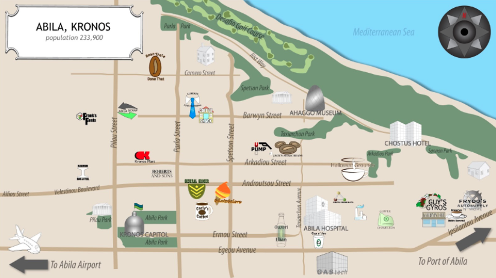
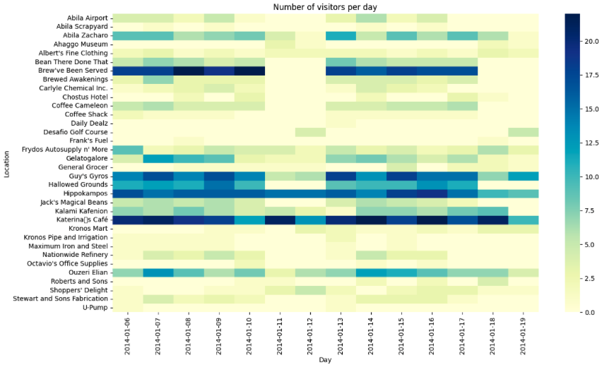
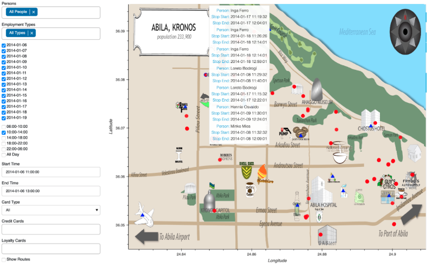
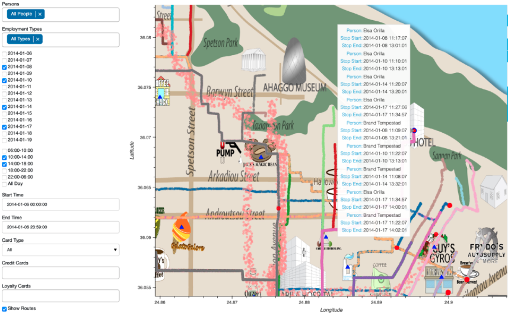

# VAST Challenge 2021 - Kronos

This project was part of the **Advanced Visual Data Analysis** course, where we participated in solving the **VAST Challenge 2021 - Kronos**. The challenge involved analyzing complex data to uncover insights about activities at the fictional island of Kronos.

## Project Overview

The VAST Challenge is a well-known competition in the visualization community that tasks participants with tackling problems through data visualization. For this challenge, we explored various techniques to make sense of multi-dimensional data, identifying patterns, and developing visualizations that provided actionable insights.

## Features

- **Data Exploration**: Our visualizations focus on identifying key patterns and trends within the data provided by the Kronos scenario.
- **Interactive Visualizations**: We developed interactive tools that allow users to dynamically explore and filter through the dataset.
- **Anomaly Detection**: We highlight anomalies and significant changes in the data over time, helping to uncover hidden information about Kronos' activities.

## Tech Stack

- **Languages**: Python, JavaScript
- **Libraries**: D3.js, Plotly
- **Tools**: Jupyter Notebooks

## Dataset

The dataset provided by the VAST Challenge 2021 represents various activities on the fictional island of Kronos, including geolocation data, and time-stamped events.

